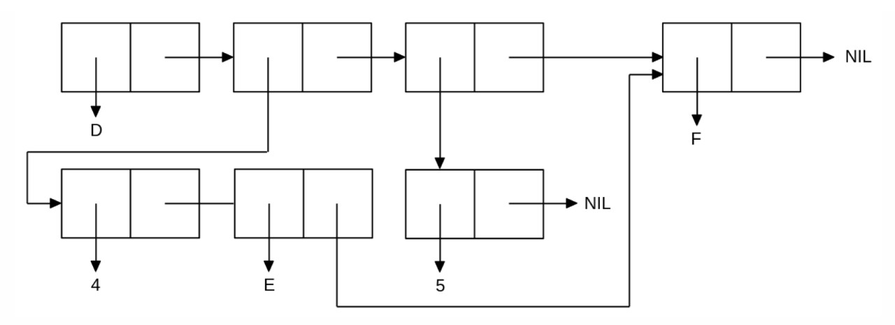

<p align="center"><b>МОНУ НТУУ КПІ ім. Ігоря Сікорського ФПМ СПіСКС</b></p>
<p align="center">
<b>Звіт з лабораторної роботи 1</b><br/>
"Обробка списків з використанням базових функцій"<br/>
дисципліни "Вступ до функціонального програмування"
</p>
<p align="right"><b>Студент(-ка)</b>: Гуманіцький Андрій Олександрович КВ-21</p>
<p align="right"><b>Рік</b>: 2025</p>

##
## Загальне завдання

1. Створити список з п'яти елементів, використовуючи функції LIST і CONS.
2. Отримати голову списку.
3. Отримати хвіст списку.
4. Отримати третій елемент списку.
5. Отримати останній елемент списку.
6. Використати предикати ATOM та LISTP на різних елементах списку (по 2-3
приклади для кожної функції).
7. Використайти на елементах списку 2-3 інших предикати з розглянутих у розділі 4
навчального посібника.
8. Об'єднайти створений список з одним із його непустих підсписків. Для цього
використайте функцію APPEND.

<p align="center"><b>Лістинг коду</b></p>

```lisp
;;1) making list general task
(defun make-my-list ()
  (cons 'A (list (list 'B 'C) () 7 "hi")))

;;1) Save list 
(defvar T1)
(set 'T1 (make-my-list))

;;2) Head
(car T1)                    ; => A

CL-USER> (car T1)
A

;;3) Tail
(cdr T1)                    ; => ((B C) NIL 7 "hi")

CL-USER> (cdr T1)
((B C) NIL 7 "hi")

;;4) 3rd element
(third T1)                  ; => NIL

CL-USER> (third T1)
NIL

;;5) last element
(car (last T1))             ; => "hi"

CL-USER> (car (last T1)) 
"hi"

;;6) ATOM та LISTP
(atom (car T1))             ; => T   
(atom (cdr T1))             ; => NIL

CL-USER> (atom (car T1)) 
T
CL-USER> (atom (cdr T1))
NIL

(listp (cdr T1))            ; => T
(listp (car (last T1)))     ; => NIL

CL-USER> (listp (cdr T1))
T
CL-USER> (listp (car (last T1)))
NIL

;;7) Different predicates
(numberp (first T1))        ; => NIL
(stringp (car (last T1)))   ; => T    
(symbolp (first T1))        ; => T 
(equal (second T1) '(B C))  ; => T

CL-USER> (numberp (first T1))
NIL
CL-USER> (stringp (car (last T1)))
T
CL-USER> (symbolp (first T1))
T
CL-USER> (equal (second T1) '(B C))
T

;;8) APPEND
(append T1 (second T1))     ; => (A (B C) NIL 7 "hi" B C)

CL-USER> (append T1 (second T1)) 
(A (B C) NIL 7 "hi" B C)
```


##
## Варіант №5
<p align="center">
Створити список, що відповідає структурі списку, наведеній на рисунку



<p align="center"><b>Лістинг коду (варіант №5)</b></p>

```lisp
;;9) making list 5 option
(defun make-my-list-2 ()
  (let ((tail (list 'F)))
    (append (list 'D
                  (append (list 4 'E) tail)
                  (list 5))
            tail ))) 

;;9) Save list
(defvar T2)
(set 'T2 (make-my-list-2))

CL-USER> T2
(D (4 E F) (5) F)
```
1.	Оголошення функції make-my-list-2 
2.	Локальна змінна tail: в блоці let створюється спільний хвіст tail = (F). Буде використано двічі
3.	Верхній рівень — append 2 елементів, один з яких список з елементів описаних у пунктах 4-6 та tail
4.	Перший елемент верхнього списку — символ D.
5.	Другий елемент — підсписок, що утворюється виразом
(append (list 4 'E) tail) → (4 E F).
6.	Третій елемент — підсписок (5), отриманий як (list 5).
7.	Остаточне «пришивання» хвоста: другий аргумент верхнього append tail. 

(D (4 E F) (5) F), де останній елемент F — той самий об’єкт, що й у підсписку (4 E F)

P.S. щодо NIL на схемі, не певен, чи потрібно їх додавати у список
