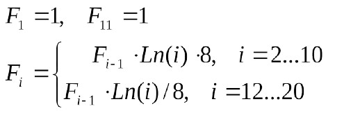
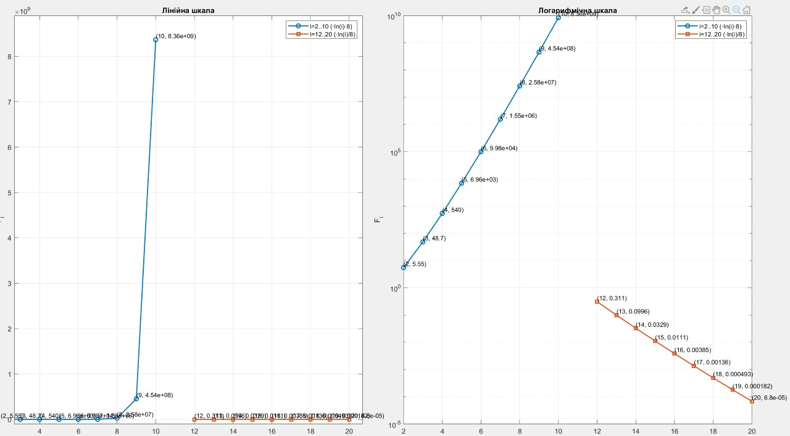
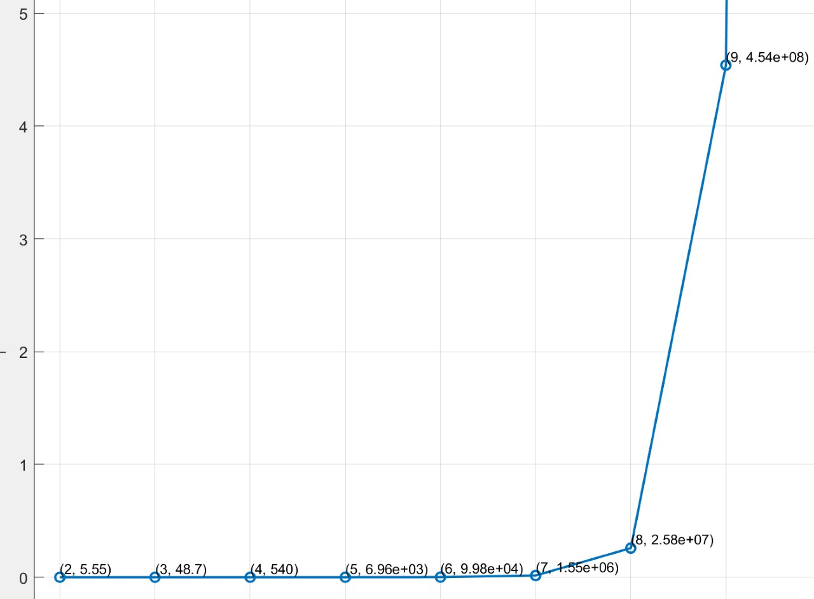

<p align="center"><b>МОНУ НТУУ КПІ ім. Ігоря Сікорського ФПМ СПіСКС</b></p>
<p align="center">
<b>Звіт з розрахунково-графічної роботи</b>
<br/><br/>
з дисципліни <br/> "Вступ до функціонального програмування"
</p>
<p align="right"><b>Студент</b>: Гуманіцький Андрій Олександрович КВ-21</p>
<p align="right"><b>Рік</b>: 2025</p>

## Загальне завдання
    1. Реалізувати програму для обчислення функції згідно варіанту мовою Common Lisp
    2. Виконати тестування реалізованої програми
    3. Порівняти результати роботи програми мовою Common Lisp с розрахунками іншими засобами

## Варіант завдання №5

<p align="center">
  
</p>


## Лістинг реалізації обчислення функції
```lisp
(defun fi (i)
  (labels ((f (k)
             (cond ((= k 1) 1d0)
                   ((= k 11) 1d0)
                   ((and (>= k 2) (<= k 10)) (* (f (1- k)) (* (log k) 8d0)))
                   ((and (>= k 12) (<= k 20)) (* (f (1- k)) (/ (log k) 8d0)))
                   (t (error "i out of range: ~A" k)))))
    (f i)))
```
### Тестові набори та утиліти
```lisp
(defun table-iter ()
  (let ((res '()) (p 1d0))
    (loop for i from 2 to 10 do
          (setf p (* p (* (log i) 8d0)))
          (push (cons i p) res))
    (setf p 1d0)
    (loop for i from 12 to 20 do
          (setf p (* p (/ (log i) 8d0)))
          (push (cons i p) res))
    (nreverse res)))

(defun print-fi-table ()
  (let ((pairs
          (append
           (loop for i from 2 to 10 collect (cons i (fi i)))
           (loop for i from 12 to 20 collect (cons i (fi i))))))
    (format t "~&  i |            Fi~%")
    (format t "----+-----------------------~%")
    (dolist (p pairs)
      (format t "~3D | ~,12,5E~%" (car p) (cdr p)))
    (values)))


(defun strictly-increasing-p (xs)
  (every #'< xs (rest xs)))

(defun strictly-decreasing-p (xs)
  (every #'> xs (rest xs)))

(defun run-checks ()
  (let* ((tbl (table-iter))
         (lookup (lambda (k) (cdr (assoc k tbl))))
         (up  (mapcar (lambda (k) (funcall lookup k)) (loop for k from 2 to 10 collect k)))
         (dn  (mapcar (lambda (k) (funcall lookup k)) (loop for k from 12 to 20 collect k))))
    (format t "~&[TEST] F1=1: ~A~%"  (= (fi 1) 1d0))
    (format t "[TEST] F11=1: ~A~%" (= (fi 11) 1d0))
    (format t "[TEST] 2..10 strictly increasing: ~A~%" (strictly-increasing-p up))
    (format t "[TEST] 12..20 strictly decreasing: ~A~%" (strictly-decreasing-p dn))
    (values)))
```
### Тестування
```lisp
CL-USER> (print-fi-table)
  i |            Fi
----+-----------------------
  2 | 5.545177459717d+00000
  3 | 4.873600168059d+00001
  4 | 5.404995559919d+00002
  5 | 6.959203946563d+00003
  6 | 9.975375776662d+00004
  7 | 1.552894754951d+00006
  8 | 2.583323097739d+00007
  9 | 4.540912883223d+00008
 10 | 8.364670766953d+00009
 12 | 3.106133341789d-00001
 13 | 9.958843075207d-00002
 14 | 3.285244811447d-00002
 15 | 1.112076004532d-00002
 16 | 3.854161746140d-00003
 17 | 1.364957804063d-00003
 18 | 4.931544430410d-00004
 19 | 1.815078928407d-00004
 20 | 6.796863232966d-00005
; No value
CL-USER> (run-checks)
[TEST] F1=1: T
[TEST] F11=1: T
[TEST] 2..10 strictly increasing: T
[TEST] 12..20 strictly decreasing: T
; No value
```

### Звірення результатів з іншими методами
<p align="center">
  
  <br>Загальна картина
</p>

<p align="center">
  
  <br>Наближений проміжок 2–10
</p>

<p align="center">
  
  <br>Наближений проміжок 12–20
</p>
